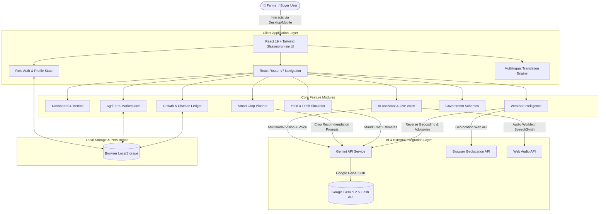
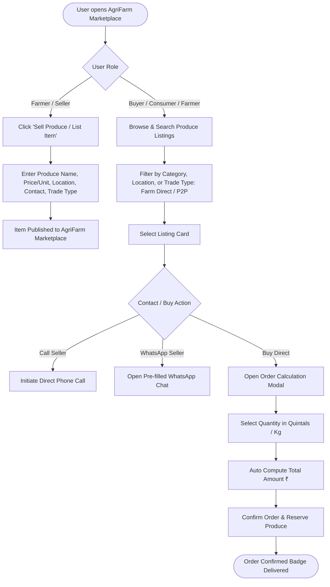
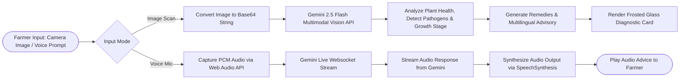

# 🌾 Kisan-Bhai (RuralAssist AI)

<p align="center">
  
</p>

<p align="center">
  <b>Empowering Indian Farmers & Agri-Traders with Next-Gen AI Advisory, Vision Diagnostics & Direct Farm-Gate Marketplace</b>
</p>

<p align="center">
  
  
  
  
  
</p>

---

## 📖 Table of Contents

- [Overview](#-overview)
- [Key Features](#-key-features)
- [System Architecture & Flowcharts](#-system-architecture--flowcharts)
  - [1. System Architecture](#1-system-architecture)
  - [2. AgriFarm Marketplace Trade Flow](#2-agrifarm-marketplace-trade-flow)
  - [3. AI Voice & Crop Disease Scan Pipeline](#3-ai-voice--crop-disease-scan-pipeline)
- [Technology Stack](#-technology-stack)
- [Directory Structure](#-directory-structure)
- [Getting Started](#-getting-started)
  - [Prerequisites](#prerequisites)
  - [Installation](#installation)
  - [Environment Configuration](#environment-configuration)
  - [Running the Application](#running-the-application)
- [Localization](#-localization)
- [License](#-license)

---

## 🌟 Overview

**Kisan-Bhai (RuralAssist AI)** is a state-of-the-art agricultural web application designed to bridge the digital gap for Indian farmers, buyers, and rural entrepreneurs. Built with a high-performance **React + TypeScript + TailwindCSS** stack and powered by **Google Gemini 2.5 Flash**, Kisan-Bhai provides hyper-local agricultural intelligence, vision-based crop disease diagnosis, real-time voice advisory, and a zero-commission farm-to-farm marketplace.

---

## ✨ Key Features

### 🛒 1. AgriFarm Direct Marketplace
- **Direct Farm Gate & Peer-to-Peer (P2P) Trading**: Buy and sell produce directly between farmers and buyers with zero middleman fees.
- **Categorized Produce Listings**: Grains & Pulses, Fresh Vegetables, Orchard Fruits, Surplus Seeds, Organic Fertilizers, and Farm Equipment.
- **Instant Communication**: Direct phone dialer integration (`tel:`) and instant WhatsApp chat links with automatic message pre-filling.
- **Order Calculation Modal**: Interactive quantity selector with automatic total price calculation and verified farm badges.

### 🤖 2. Multilingual AI Assistant ("Kisan-Bhai")
- **Native Multilingual Voice & Text**: Speaks English, Hindi (हिंदी), Punjabi (ਪੰਜਾਬੀ), and Marathi (मराठी).
- **Gemini Live Multimodal Voice**: Real-time voice conversation streaming via PCM AudioWorklet websockets.
- **Offline Rule Fallback**: Built-in intelligent fallback responses for farming queries when internet connection is limited.

### 📸 3. Vision-Based Crop Disease Scanner
- **Instant Photo Diagnostics**: Upload or capture photos of crops to detect diseases, pest infestations, nutrient deficiencies, and growth stages.
- **Actionable Remediation**: Get step-by-step chemical and organic treatment plans tailored to Indian agricultural standards.

### 📅 4. Smart Crop Season Planner
- **Regional Optimization**: Input location, season (Kharif, Rabi, Zaid), and soil type (Alluvial, Black, Red, Sandy) to get AI-recommended high-yield crops.
- **Profit & Risk Ratings**: View estimated profitability badges, water requirements, and risk factor indicators.

### 💰 5. Yield & Profit Simulator
- **Mandi Cost Breakdown**: Interactive financial calculator powered by real-time regional mandi data.
- **Dynamic Acreage Sliders**: Calculate total seed, labor, fertilizer expenses vs. expected revenue and net profit margins.

### 🌤️ 6. Hyper-Local Weather Intelligence
- **Advisory Warnings**: 7-day weather forecasts, humidity tracking, and rain warnings to prevent crop damage and optimize irrigation schedules.

### 📜 7. Government Schemes Navigator
- **Subsidy Discovery**: Instant search for PM-Kisan Samman Nidhi, PM Fasal Bima Yojana, and state-specific agricultural schemes.

### 🔐 8. Role-Based Auth System
- **Tailored User Profiles**: Seamless role selection during login (`Sell Produce`, `Direct Buy`, `Both`) with glassmorphism UI.

---

## 📐 System Architecture & Flowcharts

### 1. System Architecture



---

### 2. AgriFarm Marketplace Trade Flow



---

### 3. AI Voice & Crop Disease Scan Pipeline



---

## 🛠️ Technology Stack

| Category | Technologies |
| :--- | :--- |
| **Frontend Framework** | React 19, TypeScript, Vite 6 |
| **Styling & Aesthetics** | TailwindCSS, Vanilla CSS, Glassmorphism backdrop-blur UI |
| **Icons & Visuals** | Lucide React |
| **Charts & Analytics** | Recharts |
| **Routing** | React Router DOM v7 (HashRouter) |
| **Artificial Intelligence** | `@google/genai` (Google Gemini 2.5 Flash), Gemini Multimodal Live API |
| **Browser APIs** | Web Audio API, SpeechSynthesis API, Geolocation API, LocalStorage |

---

## 📁 Directory Structure

```
kisan-bhai/
├── components/
│   ├── AgriFarm.tsx         # AgriFarm Direct Marketplace & Trading Modal
│   ├── Auth.tsx             # Two-Column Glassmorphism Role Auth Screen
│   ├── Chat.tsx             # Multilingual AI Voice & Text Chat Assistant
│   ├── CropPlanner.tsx      # Regional Soil & Seasonal Crop Planner
│   ├── Dashboard.tsx        # Main Overview Dashboard & Metric Cards
│   ├── GrowthTracker.tsx    # Crop Growth Timeline & Vision Diagnostic Ledger
│   ├── Layout.tsx           # Main Shell, Sticky Header & Collapsible Sidebar
│   ├── Profile.tsx          # Farm Profile Settings & Location Detection
│   ├── ProfitSimulator.tsx  # Yield & Mandi Profit Calculator with Recharts
│   ├── Schemes.tsx          # Government Subsidies & Schemes Navigator
│   └── Weather.tsx          # Weather Intelligence & Rain Alert Advisories
├── services/
│   └── geminiService.ts     # Google Gemini API integration & Fallback Engine
├── public/
│   └── wheat_field.jpg      # Farmland Landscape Background Asset
├── App.tsx                  # Main App Entrypoint & Route Registry
├── types.ts                 # TypeScript Interfaces (FarmProfile, AgriItem, etc.)
├── translations.ts          # Multilingual Dictionaries (EN, HI, PA, MR)
├── index.html               # Main HTML Template
├── package.json             # Dependencies & Build Scripts
├── vite.config.ts           # Vite Build Configuration
└── README.md                # Project Documentation
```

---

## 🚀 Getting Started

### Prerequisites

Ensure you have the following installed on your local machine:
- **Node.js**: `v18.0.0` or higher
- **npm**: `v9.0.0` or higher

### Installation

1. **Clone the repository**:
   ```bash
   git clone https://github.com/sushantchand890-creator/kisan-bhai.git
   cd kisan-bhai
   ```

2. **Install dependencies**:
   ```bash
   npm install
   ```

### Environment Configuration

Create a `.env` file in the root directory of the project and add your **Google Gemini API Key**:

```env
VITE_GEMINI_API_KEY=your_gemini_api_key_here
```

> **Note**: You can get a free Gemini API key from [Google AI Studio](https://aistudio.google.com/).

### Running the Application

- **Development Server**:
  ```bash
  npm run dev
  ```
  The app will run locally at `http://localhost:5173`.

- **Build Production Bundle**:
  ```bash
  npm run build
  ```

- **Preview Production Build**:
  ```bash
  npm run preview
  ```

---

## 🌐 Localization

Kisan-Bhai fully supports **4 major Indian regional languages**:

- 🇬🇧 **English** (`en`)
- 🇮🇳 **Hindi - हिंदी** (`hi`)
- 🇮🇳 **Punjabi - ਪੰਜਾਬੀ** (`pa`)
- 🇮🇳 **Marathi - मराठी** (`mr`)

Switch languages seamlessly from the top navigation bar at any time.

---

## 📄 License

This project is licensed under the **MIT License** - see the [LICENSE](LICENSE) file for details.

---

<p align="center">
  Made with ❤️ for Indian Agriculture & Farmers
</p>
